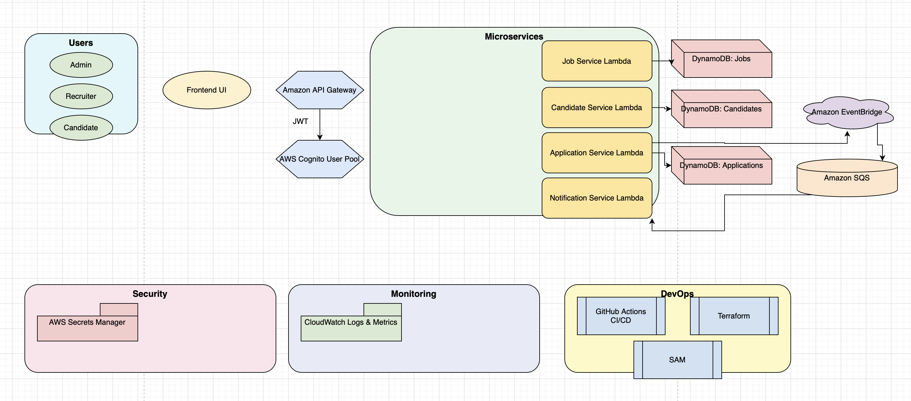

# SmartHire

SmartHire is a microservices-based hiring platform designed with modern cloud-native principles, leveraging AWS services such as Lambda, DynamoDB, EventBridge, and SQS for scalability, reliability, and maintainability.

---

## Architecture Overview

The system is composed of several loosely coupled microservices, each responsible for a specific domain area:

- **Job Service:** Manages job listings and queries.
- **Candidate Service:** Handles candidate profiles and resumes.
- **Application Service:** Processes job applications and status updates.
- **Notification Service:** Sends alerts and notifications via email/SMS.

Each microservice is independently deployable, runs as AWS Lambda functions triggered by API Gateway, SQS queues, or EventBridge events.

## SmartHire Architecture Diagram

### Key AWS Components

- **AWS Lambda:** Stateless serverless compute for running microservices.
- **Amazon API Gateway:** REST API front door exposing Lambda functions securely.
- **Amazon DynamoDB:** NoSQL database providing scalable, low-latency storage for jobs, candidates, applications.
- **Amazon SQS:** Decouples microservices for asynchronous processing.
- **Amazon EventBridge:** Event bus for routing domain events across services, enabling event-driven architecture.
- **AWS Secrets Manager:** Secure storage of sensitive config and credentials.

### Sample API Endpoint

- **Job Service GET /jobs:**  
  `https://mghanqmx6g.execute-api.ap-southeast-2.amazonaws.com/Prod/jobs`

---
📄 [Decision Log](docs/decision_log.md)

## 12-Factor App Compliance Checklist

| #  | Factor           | Description                             | SmartHire Practice                                         | Status    |
| ---|------------------|------------------------------------- |-----------------------------------------------------------|-----------|
| 1  | Codebase         | One codebase per app, many deploys   | Each microservice (job-service, candidate-service, etc.) is in its own repo or subfolder | ✅         |
| 2  | Dependencies     | Explicit, isolated dependencies      | `.csproj` files declare NuGet packages; Docker or Lambda isolates runtime | ✅         |
| 3  | Config           | Config stored in environment vars    | Lambda env vars + Secrets Manager for sensitive info       | ✅         |
| 4  | Backing Services | External services are attached resources | DynamoDB, SQS, EventBridge configured via env              | ✅         |
| 5  | Build, Release, Run | Separate build/release/run stages  | GitHub Actions handles build + deploy via SAM/Terraform   | ✅         |
| 6  | Processes        | Stateless processes                  | Each Lambda is stateless, stores no local data             | ✅         |
| 7  | Port Binding     | App exposes services via a port      | Local APIs use ports; AWS APIs go through API Gateway      | ✅         |
| 8  | Concurrency      | Scaled via process model             | Lambdas scale per SQS/EventBridge/API Gateway events       | ✅         |
| 9  | Disposability    | Fast startup, graceful shutdown      | Lambdas start quickly, clean shutdowns via try-finally     | ✅         |
| 10 | Dev/Prod Parity | Minimize environment drift            | Terraform/SAM deploys identical infra per environment      | ✅         |
| 11 | Logs            | Logs treated as event streams         | Console logs auto-stream to CloudWatch                      | ✅         |
| 12 | Admin Processes | One-off tasks as standalone scripts   | CLI or one-off Lambda for migrations/seed tasks            | 🟡 (planned) |

---

## Local Development & Deployment

- **Backend:** Developed in .NET 6, deployable via AWS SAM or Terraform.
- **Frontend:** Currently runs on `http://localhost:4200` during development; CORS is configured accordingly.
- **CI/CD:** GitHub Actions pipeline manages build, tests, and deployment.

---

## Next Steps / Planned Features

- Complete admin scripts for database migrations and seeding.
- Add authentication and authorization integration.
- Deploy frontend to cloud with proper domain and HTTPS.
- Enhance monitoring and alerting.

---

For detailed docs, architecture diagrams, and API specs, refer to the `docs/` folder (coming soon).

---

*This project embraces cloud-native best practices and is continuously evolving.*

